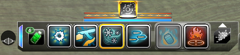

# TMToggle
SWL mod for easily toggling ground targeting mode  

  
Icon can be moved and resized in GUI-Edit mode.  
Crosshair on bottom means ground targeting is enabled, crosshair on side means direct targeting.  
Clicking the icon or using Shift + "Attack Stance" keybind will invert the ground targeting mode.  

**Install**  
Unzip to `Secret World Legends\Data\Gui\Custom\Flash`  